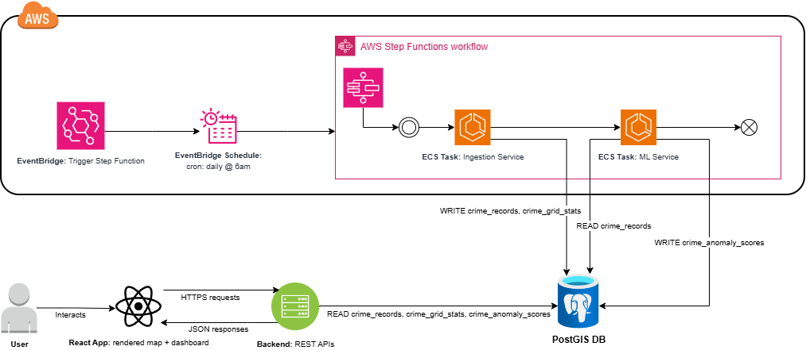
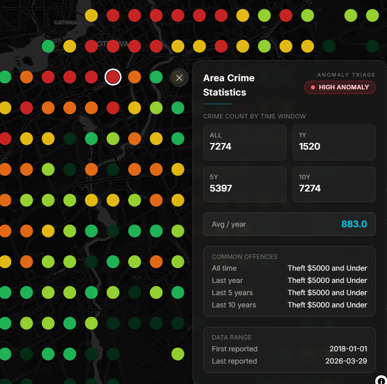
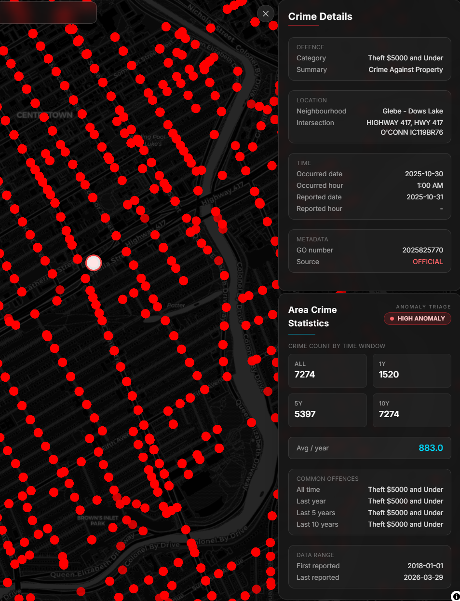
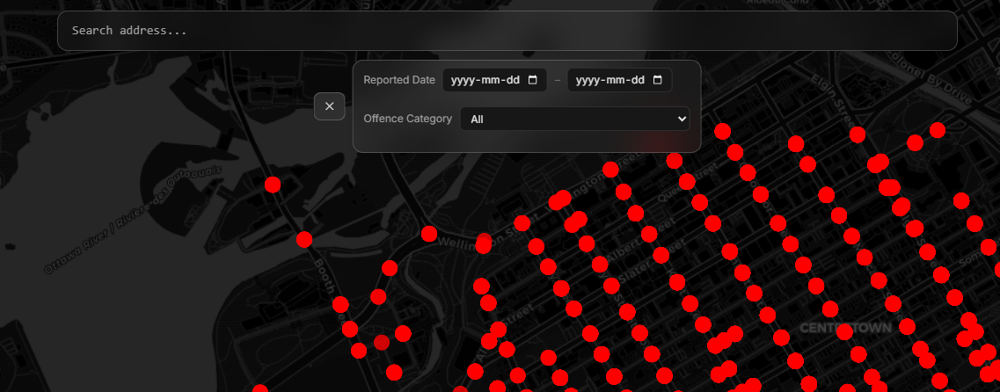

# Ottawa CrimeLens — System Overview

A geospatial crime analysis platform that ingests, processes, and detects anomalous crime activity using machine learning.

---

## Overview

Ottawa CrimeLens is a full-stack distributed system designed to analyze Ottawa crime data across spatial grids and surface anomalous activity patterns.

The platform is composed of multiple services working together:

- Data ingestion pipeline (Spring Boot)
- ML anomaly detection pipeline (Python + Isolation Forest)
- Backend API service (Spring Boot)
- Frontend dashboard (React + TypeScript)

---

## Repositories

| Component | Description | Link |
|----------|------------|------|
| Frontend | User-facing dashboard for visualizing crime data | https://github.com/tazim04/ottawa-crime-lens-frontend |
| Backend APIs | REST APIs for querying processed crime data | https://github.com/tazim04/Ottawa-Crime-Lens-Query |
| Ingestion Pipeline | Scheduled pipeline to ingest and store crime data | https://github.com/tazim04/Ottawa-Crime-Lens-Pipeline |
| ML Pipeline | Detects anomalous crime patterns across grid cells | https://github.com/tazim04/ottawa-crimelens-ml |

---

## System Flow

1. EventBridge triggers the main Step Functions workflow daily.
2. The workflow runs ingestion first, and the ingestion service fetches/stores fresh crime data in PostgreSQL/PostGIS.
3. After ingestion, the scoring service starts and pulls the latest model artifact from Amazon S3.
4. The scoring service computes anomaly scores per grid cell and writes results to PostgreSQL/PostGIS.
5. In parallel to the daily scoring loop, a separate weekly EventBridge cron triggers the training workflow.
6. The training service retrains the Isolation Forest model on the latest crime data and pushes a new `joblib` artifact to Amazon S3.
7. The next daily scoring run automatically consumes that newly published S3 artifact, creating a continuous train-then-serve cycle rather than a strictly linear pipeline.
8. Backend APIs serve scored data and the frontend visualizes crime activity and anomalies on the interactive map (maplibre).

---

## System Architecture

---

## How to Use the Dashboard

### 1) Area Crime Statistics (Grid View)

When you first open the map, you will see grid-based area statistics. Each grid cell summarizes crime activity for that area and helps you compare neighborhoods quickly.

- **Crime Count By Time Window:** Number of crime incidents in that grid area for x time period.
- **Avg / year:** Average number of crimes incidents per year.
- **Common Offences:** Breakdown of the most common offence types (for example theft, assault, mischief) within the selected area.
- **Anomaly Triage:** A label applied to every grid-cell based on a computed anomaly score from the ML pipeline.

>NOTE: The label `unscored` means that the selected grid-cell did not have enough recent crime activity to form a reasonable baseline to compute an anomaly score (typically in low crime areas.. must be a safe place!!!).

### 2) Zoomed-In View (Individual Crimes)

As you zoom in further, the map transitions from summarized grid cells to individual crime points/events.

- Each marker represents a specific reported incident.
- This view is designed for street-level inspection and local pattern discovery.
- Use this mode to investigate exactly where incidents occurred, not just which larger area is active.

### 3) Address Bar and Filters

- **Address bar:** Lets you jump directly to a location instead of manually panning/zooming.
- **Filters panel:** Refines visible incidents by available dimensions (such as type or timeframe) for focused analysis.
- **Important behavior:** Filters apply only to the zoomed-in individual crime view, not to the area/grid summary view.

---

## ML Service Workflow (Short Overview)

1. **Input from CrimeLens data**  
	The ML service reads the latest cleaned and grid-aggregated crime records produced by the ingestion pipeline.

2. **Feature building**  
	For each grid cell and time window, the pipeline builds numeric features that summarize crime behavior (for example: incident counts, category mix, recent trend/change, and spatial context). These features convert raw events into a model-ready vector per grid/time slice.

3. **Training with Isolation Forest**  
	The model is trained in an unsupervised way on historical feature vectors. Isolation Forest learns what "normal" crime patterns look like by randomly partitioning the feature space; points that are isolated in fewer splits are treated as more anomalous.
	Training is automated on AWS as a weekly cron job, retraining on the latest newly ingested data. At the end of training, the model artifact is serialized as a `joblib` file and pushed to Amazon S3.

4. **Scoring**  
	During scoring, the latest `joblib` model artifact is pulled from Amazon S3 and used to score the newest feature vectors. The pipeline outputs an anomaly score (and anomaly flag) per grid cell/time slice, where more extreme scores indicate less typical crime activity versus historical baseline.

5. **Write-back to database**  
	Final scores are persisted to PostgreSQL/PostGIS in the `crime_anomaly_scores` table. The backend APIs service then reads these scored results so the frontend can render anomaly triage labels.

---

## Tech Stack

- **Frontend:** React, TypeScript  
- **Backend:** Spring Boot (Java)  
- **ML:** Python, scikit-learn (Isolation Forest)
- **Database:** PostgreSQL + PostGIS (Neon)
- **Infrastructure:** Docker, AWS ECS Fargate, EventBridge, Step Functions  

---

## Deployment

- All services are containerized using Docker
- Images are stored in AWS ECR
- ECS Fargate is used to run scheduled and on-demand tasks
- EventBridge triggers the Step Functions orchestration workflow as a daily cron job
- Step Functions manages multi-step pipeline (ingestion -> ML scoring)

---

## Key Design Decisions

- Used **Isolation Forest** for unsupervised anomaly detection on crime patterns
- Designed **daily batch scoring** instead of real-time processing for simplicity and cost efficiency
- Leveraged **PostGIS** for spatial aggregation and grid-based analysis
- Separated ingestion, ML, and APIs into independent services for scalability and modularity
- Deployed Backend APIs service locally on-prem to avoid always-on cloud costs

---

## Live Demo

https://www.ottawacrimelens.ca/

---

## Author

Built by Tazim Khan

Made with ❤️ for the Ottawa community
